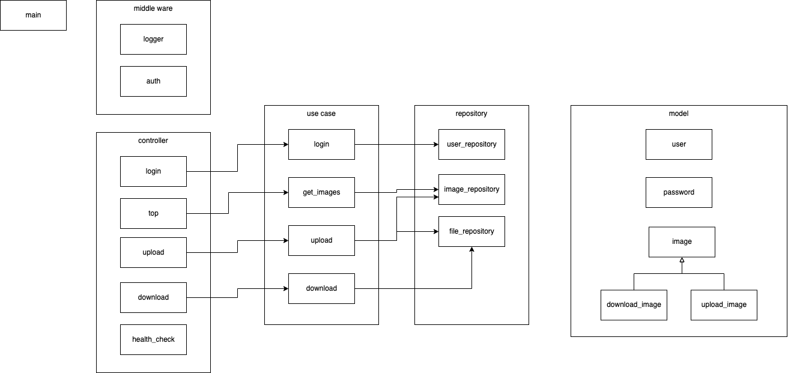

# hj-sample-app
画像をS3に保管するサンプルアプリケーションです。

# システム構成


# 設定

ローカルで実行する場合は環境変数の設定は不要

# ローカル環境での実行方法
## 事前準備
1. 以下がインストールされていること
    * Docker(Cloud9ではインストール済み)
    * Docker Compose([Cloud9でもインストールが必要](./HowToInstallDc.md))
    * AWS CLI(Cloud9ではインストール済み)

2. LocalStack用のAWSプロファイルの作成

以下のコマンドでLocalStack用のAWSプロファイルを作成する

`aws configure --profile localstack`

設定する値は以下

  ```
  AWS Access Key ID [None]: dummy
  AWS Secret Access Key [None]: dummy
  Default region name [None]: us-east-1
  Default output format [None]: json
  ```

## Docker コンテナの立ち上げ
`docker-compose up -d`

## S3 Bucketの作成
  Bucketを2つ作成する  
  * hj-202208-image-original  
  `aws --endpoint-url=http://localhost:4566 --profile localstack s3 mb s3://hj-202208-image-original`

  * hj-202208-image-thumbnail  
  `aws --endpoint-url=http://localhost:4566 --profile localstack s3 mb s3://hj-202208-image-thumbnail`

  Publicアクセスを許可する  

  * hj-202208-image-original  
  `aws --endpoint-url=http://localhost:4566 --profile localstack s3api put-public-access-block --bucket hj-202208-image-original --public-access-block-configuration  "BlockPublicAcls=false,IgnorePublicAcls=false,BlockPublicPolicy=false,RestrictPublicBuckets=false"`

  * hj-202208-image-thumnail  
  `aws --endpoint-url=http://localhost:4566 --profile localstack s3api put-public-access-block --bucket hj-202208-image-thumbnail --public-access-block-configuration  "BlockPublicAcls=false,IgnorePublicAcls=false,BlockPublicPolicy=false,RestrictPublicBuckets=false"`

  バケットポリシーを設定
  * hj-202208-image-original  
  `aws --endpoint-url=http://localhost:4566 --profile localstack s3api put-bucket-policy --bucket hj-202208-image-original --policy file://services/bucket-policy/original-policy.json`

  * hj-202208-image-original  
  `aws --endpoint-url=http://localhost:4566 --profile localstack s3api put-bucket-policy --bucket hj-202208-image-thumbnail --policy file://services/bucket-policy/thumbnail-policy.json`

## 必要なモジュールをインストール
`npm install`

## アプリケーションの立ち上げ
`npm run start-local`
